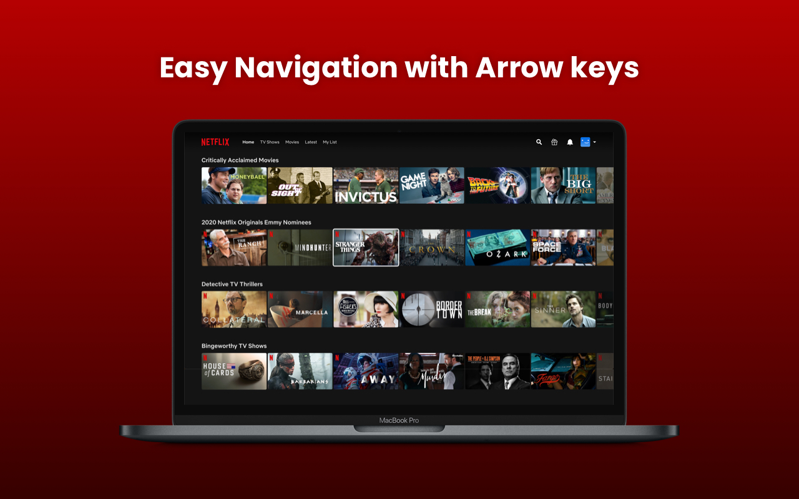
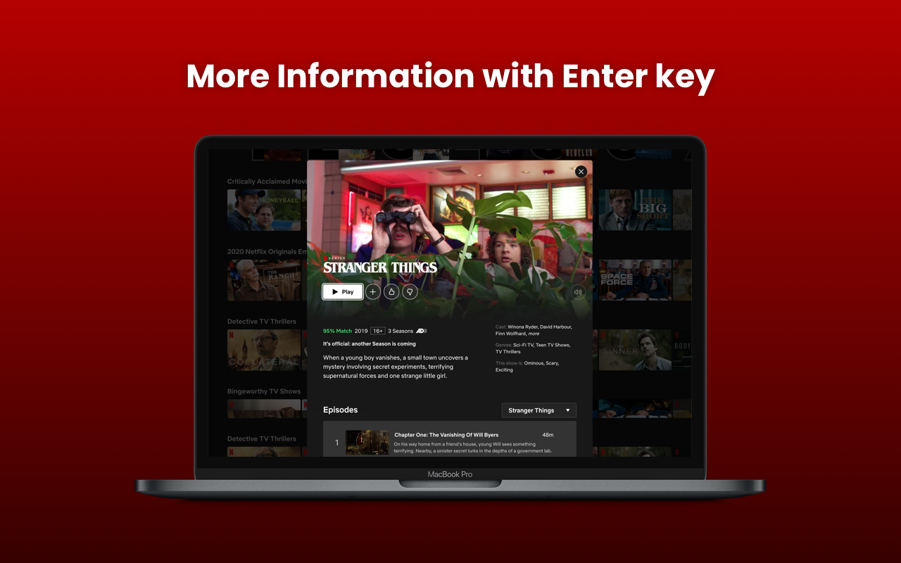
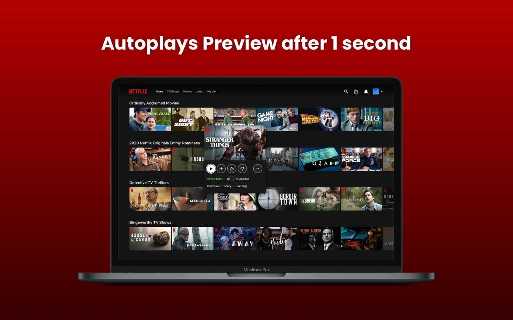
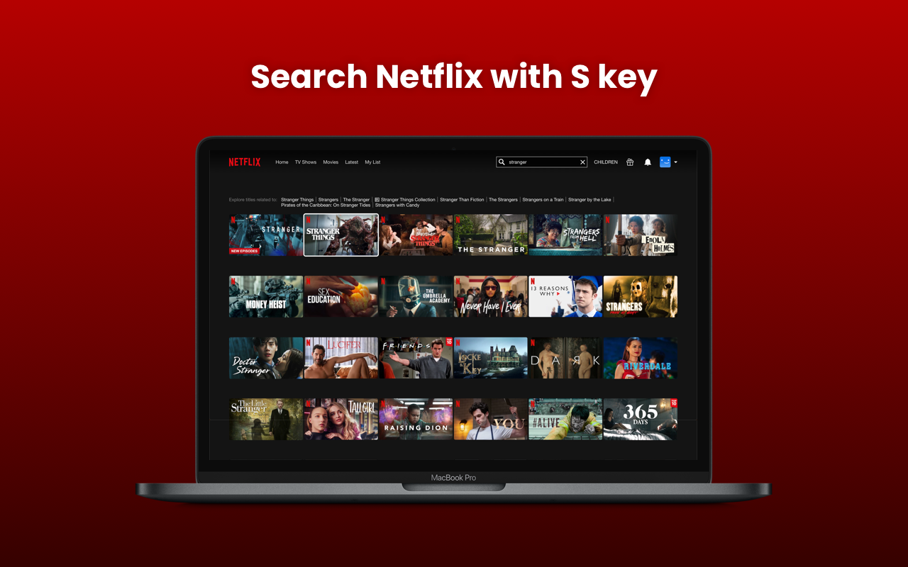

# Netflix Navigator

Browse unlimited Netflix TV Shows and Movies easily with your Keyboard Arrow Keys. (With no tracking. Google analytics have been removed)

## Install

[**FireFox** extension](https://chrome.google.com/webstore/detail/netflix-navigator/kiikkoajobekfkpgaojoincnfombbaco)

## Features

* Easily browse Netflix TV Shows and Movies with keyboard arrow keys.

* See more information of a TV show and Movie by pressing Enter key.

* Preview video will automatically start after 1 second

* Quickly search a TV show or Movie by pressing S key

## Contribution

Suggestions and pull requests are welcomed!.

---
[Forked from](https://github.com/dutiyesh/netflix-navigator)
[**OG Chrome** extension](https://chrome.google.com/webstore/detail/netflix-navigator/kiikkoajobekfkpgaojoincnfombbaco)
This project was bootstrapped with [Chrome Extension CLI](https://github.com/dutiyesh/chrome-extension-cli)
